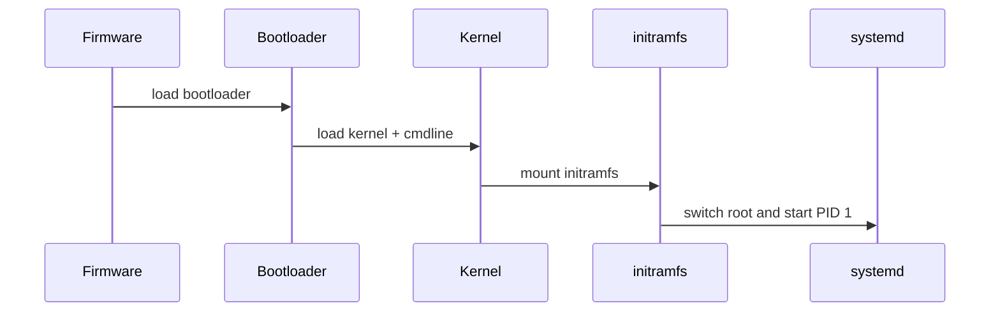

# 6-Month Transition Roadmap into Systems / Platform Engineering

**Target profile:** Senior Linux Platform / Systems Engineer with embedded Linux, secure platform, firmware, and edge-device specialization.

**Designed for:** Your background in Edge Computing, IoT, Embedded Systems, Buildroot, C/C++, TPM/BIOS, Ubuntu platform enablement, firmware architecture, and cross-functional hardware/software delivery.

**Main goal after 6 months:** Be credible for roles such as:

- Linux Platform Engineer
- Embedded Linux Engineer
- Platform Software Engineer
- Edge Systems Engineer
- BSP Engineer
- Device Security Engineer
- Secure Platform Engineer
- Firmware Platform Engineer
- Systems Software Engineer, platform-focused
- Edge AI Platform Engineer

---

## 0. Strategy Overview

You should **not** position yourself as an entry-level OS engineer. You already have 10+ years of engineering experience. The transition should be framed as:

> From embedded/IoT/edge engineering leader → senior platform/systems engineer focused on Linux platforms, secure boot, trusted devices, and edge infrastructure.

Your best niche is not pure academic OS work. It is:

> Linux platform + secure boot + firmware + TPM + embedded Linux + edge deployment.

This is more aligned with your experience and more attractive to companies building AI PCs, edge servers, embedded appliances, robotics, smart infrastructure, and secure enterprise devices.

---

## 1. Weekly Time Budget

Assuming you are working full-time, target **8–12 hours/week**.

Recommended split:

| Activity | Hours / Week | Purpose |
|---|---:|---|
| Reading / structured learning | 2–3 | Build mental models |
| Hands-on labs | 4–6 | Build real capability |
| Notes / GitHub documentation | 1–2 | Create visible proof |
| Interview practice | 1 | Convert learning into job readiness |

If you have a lighter week, protect the hands-on lab first. Reading without labs is much less useful for systems roles.

---

## 2. Portfolio You Should Build During These 6 Months

By the end, you should have a public GitHub portfolio with 3–4 strong repositories or one monorepo containing several modules.

Recommended portfolio name:

```text
linux-platform-lab
```

Suggested structure:

```text
linux-platform-lab/
  01-linux-boot-notes/
  02-system-programming-labs/
  03-kernel-module-labs/
  04-device-tree-labs/
  05-buildroot-secure-platform/
  06-debugging-performance-labs/
  07-edge-platform-demo/
  README.md
```

Each folder should include:

- Short problem statement
- What you built
- How to reproduce
- What you learned
- Diagrams where useful
- Debug logs or screenshots where appropriate
- Interview-style explanation

This matters because hiring managers for systems roles often care less about polished app demos and more about whether you can debug, reason, and explain platform behavior.

---

# Month 1 — Linux Internals and System Programming Foundation

## Month 1 Goal

Build a practical mental model of Linux as a running system:

```text
Bootloader → Kernel → initramfs → init system → userspace services → processes → filesystems → devices
```

You should be able to explain:

- What happens from power-on to login prompt
- How a Linux process starts and exits
- How userspace interacts with kernel APIs
- How filesystems, `/proc`, `/sys`, and device nodes fit together
- How to debug basic Linux behavior using standard tools

---

## Week 1 — Linux Boot Flow and Platform Startup

### Core topics

- UEFI boot overview
- GRUB basics
- Kernel image loading
- Kernel command line
- initramfs purpose
- systemd as PID 1
- Boot logs and early userspace

### Study resources

- Linux kernel admin guide: https://docs.kernel.org/admin-guide/index.html
- systemd overview: https://systemd.io/
- systemd manual page: https://man7.org/linux/man-pages/man1/systemd.1.html
- Arch Wiki boot process overview: https://wiki.archlinux.org/title/Arch_boot_process
- Your own previous secure boot / shim / GRUB notes

### Hands-on labs

1. On a Linux VM or spare machine, collect boot information:

```bash
cat /proc/cmdline
dmesg -T | less
journalctl -b
systemd-analyze
systemd-analyze blame
systemd-analyze critical-chain
lsinitramfs /boot/initrd.img-$(uname -r) 2>/dev/null || true
```

2. Identify:

- Kernel command line parameters
- Root filesystem mount point
- Init system
- Slowest boot services
- Early kernel messages

3. Write a boot-flow diagram:

```text
Firmware → Bootloader → Kernel → initramfs → real rootfs → systemd → services
```

### Deliverable

Create:

```text
01-linux-boot-notes/week01-boot-flow.md
```

Include:

- Your own explanation of the boot sequence
- Output snippets from `dmesg`, `journalctl`, `systemd-analyze`
- A diagram
- 5 interview questions and your answers

### Interview questions to prepare

- What is initramfs and why is it needed?
- What is the kernel command line?
- What is PID 1?
- How does systemd decide service startup order?
- How would you debug a slow boot?

---

## Week 2 — Processes, Threads, Signals, and Memory

### Core topics

- Process vs thread
- `fork()` / `exec()` / `wait()`
- Process states
- Signals
- Virtual memory basics
- Stack vs heap
- `/proc/<pid>`

### Study resources

- The Linux Programming Interface: https://man7.org/tlpi/
- Linux man pages: https://man7.org/linux/man-pages/
- `fork(2)`: https://man7.org/linux/man-pages/man2/fork.2.html
- `execve(2)`: https://man7.org/linux/man-pages/man2/execve.2.html
- `signal(7)`: https://man7.org/linux/man-pages/man7/signal.7.html
- `/proc` manual: https://man7.org/linux/man-pages/man5/proc.5.html

### Hands-on labs

Write small C programs:

1. `fork_exec_demo.c`
   - Parent forks child
   - Child calls `execvp()`
   - Parent waits and prints exit status

2. `signal_demo.c`
   - Register signal handler for `SIGINT`
   - Print message safely
   - Exit cleanly

3. `memory_layout_demo.c`
   - Print addresses of global variable, stack variable, heap allocation, function pointer

Run:

```bash
gcc -Wall -Wextra -g fork_exec_demo.c -o fork_exec_demo
strace -f ./fork_exec_demo
cat /proc/$(pidof your_process)/maps
```

### Deliverable

Create:

```text
02-system-programming-labs/week02-process-memory/
```

Include:

- Source code
- Makefile
- README explaining `fork`, `exec`, `wait`, signals, and memory layout
- Example `strace` output

### Interview questions to prepare

- What is the difference between `fork()` and `exec()`?
- What happens to memory after `fork()`?
- What is copy-on-write?
- What are signals used for?
- What is the difference between process virtual memory and physical memory?

---

## Week 3 — Filesystems, VFS, Device Nodes, `/proc`, and `/sys`

### Core topics

- VFS concept
- Mount points
- Device nodes
- `udev`
- `/proc` vs `/sys`
- File descriptors
- Basic filesystem debugging

### Study resources

- `proc(5)`: https://man7.org/linux/man-pages/man5/proc.5.html
- `sysfs(5)`: https://man7.org/linux/man-pages/man5/sysfs.5.html
- `open(2)`: https://man7.org/linux/man-pages/man2/open.2.html
- `read(2)`: https://man7.org/linux/man-pages/man2/read.2.html
- `write(2)`: https://man7.org/linux/man-pages/man2/write.2.html
- Linux Device Drivers, older but useful conceptually: https://lwn.net/Kernel/LDD3/

### Hands-on labs

1. Explore mounts:

```bash
findmnt
mount | less
cat /proc/mounts
lsblk
```

2. Explore devices:

```bash
ls -l /dev | head
udevadm info --query=all --name=/dev/null
udevadm monitor
```

3. Write a C program:

```text
fd_inspector.c
```

It should:

- Open a file
- Print file descriptor number
- Sleep for 30 seconds
- During sleep, inspect `/proc/<pid>/fd`

4. Explore:

```bash
ls -l /proc/$$/fd
cat /proc/$$/status
ls /sys/class
```

### Deliverable

Create:

```text
02-system-programming-labs/week03-filesystems-devices/
```

Include:

- Notes explaining `/proc`, `/sys`, `/dev`
- C file descriptor demo
- Screenshots or command output
- Explanation of how device nodes relate to drivers

### Interview questions to prepare

- What is VFS?
- What is the difference between `/proc` and `/sys`?
- What is a device node?
- What does `udev` do?
- What is a file descriptor?

---

## Week 4 — Systemd, Services, Logs, and Practical Linux Debugging

### Core topics

- systemd unit files
- Service dependencies
- Targets
- Logging with journald
- Debugging failed services
- Basic service hardening

### Study resources

- systemd project: https://systemd.io/
- `systemd.service`: https://www.freedesktop.org/software/systemd/man/latest/systemd.service.html
- `systemd.unit`: https://www.freedesktop.org/software/systemd/man/latest/systemd.unit.html
- `journalctl`: https://www.freedesktop.org/software/systemd/man/latest/journalctl.html

### Hands-on labs

Create a simple service:

```text
platform-heartbeat.service
```

It runs a small shell or Python script that writes heartbeat logs every 5 seconds.

Practice:

```bash
systemctl daemon-reload
systemctl start platform-heartbeat
systemctl status platform-heartbeat
journalctl -u platform-heartbeat -f
systemctl enable platform-heartbeat
systemctl list-dependencies platform-heartbeat
```

Then intentionally break it:

- Wrong path
- Missing permission
- Bad environment variable
- Crashing process

Debug using:

```bash
systemctl status
journalctl -xeu platform-heartbeat
```

### Deliverable

Create:

```text
02-system-programming-labs/week04-systemd-debugging/
```

Include:

- Service file
- Script
- README with failure cases and debugging steps
- Notes on systemd dependencies

### Month 1 checkpoint

You should now be able to explain:

- Linux boot flow
- Role of initramfs and systemd
- Process creation
- Signals and file descriptors
- `/proc`, `/sys`, `/dev`
- How to debug failed services

### Resume improvement after Month 1

You can start using wording like:

```text
Built hands-on Linux platform labs covering boot flow, process lifecycle, systemd services, /proc, /sys, device nodes, and service debugging.
```

---

# Month 2 — Kernel Modules, Driver Model, and Device Tree

## Month 2 Goal

Become comfortable with how Linux represents hardware and drivers.

You do not need to become a kernel maintainer. You need enough kernel/platform fluency to be credible in embedded Linux and platform roles.

---

## Week 5 — Kernel Build Environment and Simple Kernel Modules

### Core topics

- Kernel source tree basics
- Kernel module build process
- `insmod`, `rmmod`, `modprobe`
- `printk`
- `dmesg`
- Module parameters

### Study resources

- Linux kernel documentation: https://docs.kernel.org/
- Kernel modules guide: https://docs.kernel.org/kbuild/modules.html
- Linux Kernel Labs by Bootlin: https://linux-kernel-labs.github.io/refs/heads/master/
- Bootlin training docs: https://bootlin.com/docs/

### Hands-on labs

Create a simple module:

```c
hello_platform.c
```

Features:

- Prints message at load
- Prints message at unload
- Accepts module parameter `name`
- Logs using `pr_info()`

Commands:

```bash
make
sudo insmod hello_platform.ko name=Sam
dmesg | tail
lsmod | grep hello_platform
sudo rmmod hello_platform
dmesg | tail
```

### Deliverable

Create:

```text
03-kernel-module-labs/week05-simple-module/
```

Include:

- Source code
- Makefile
- README
- Explanation of module lifecycle

### Interview questions

- What is a kernel module?
- Difference between `insmod` and `modprobe`?
- What is `printk`?
- What risks exist when writing kernel code?
- What happens if a kernel module crashes?

---

## Week 6 — Character Device Driver

### Core topics

- Character device concept
- Major/minor numbers
- `file_operations`
- `open`, `read`, `write`, `release`
- `copy_to_user()` / `copy_from_user()`
- Device node creation

### Study resources

- Linux kernel driver API: https://docs.kernel.org/driver-api/index.html
- Driver model docs: https://docs.kernel.org/driver-api/driver-model/index.html
- Linux Device Drivers: https://lwn.net/Kernel/LDD3/

### Hands-on labs

Build:

```text
platform_echo_char_driver
```

Features:

- `/dev/platform_echo`
- Userspace can write a string
- Userspace can read back the string
- Logs open/read/write operations

Test:

```bash
echo "hello" | sudo tee /dev/platform_echo
sudo cat /dev/platform_echo
dmesg | tail -50
```

### Deliverable

Create:

```text
03-kernel-module-labs/week06-char-driver/
```

Include:

- Driver source
- User test program
- README explaining kernel/user boundary
- Notes about safety and error handling

### Interview questions

- What is a character device?
- What is `file_operations`?
- Why do we need `copy_to_user()`?
- What is a major/minor number?
- How does userspace access a kernel driver?

---

## Week 7 — Linux Device Model and Platform Drivers

### Core topics

- Device model
- Bus/device/driver relationship
- Platform devices
- `probe()` and `remove()`
- sysfs attributes
- Managed resources with `devm_*`

### Study resources

- Linux driver model: https://docs.kernel.org/driver-api/driver-model/index.html
- Platform devices and drivers: https://docs.kernel.org/driver-api/driver-model/platform.html
- Device drivers: https://docs.kernel.org/driver-api/driver-model/driver.html

### Hands-on labs

Build a platform driver:

```text
platform_status_driver
```

Features:

- Registers platform driver
- Implements `probe()` and `remove()`
- Exposes sysfs attribute:

```text
/sys/bus/platform/devices/.../status
```

Optional:

- Add writable attribute to update internal state

### Deliverable

Create:

```text
03-kernel-module-labs/week07-platform-driver/
```

Include:

- Source code
- README explaining device/driver binding
- Diagram showing bus/device/driver model

### Interview questions

- What is the Linux device model?
- What is the difference between a device and a driver?
- What is `probe()`?
- What is sysfs used for?
- Why are platform drivers common in embedded Linux?

---

## Week 8 — Device Tree Basics

### Core topics

- Device Tree purpose
- DTS / DTSI / DTB
- `compatible` strings
- Properties
- GPIOs, interrupts, clocks conceptually
- Driver matching using Device Tree

### Study resources

- Linux and Devicetree: https://docs.kernel.org/devicetree/usage-model.html
- Devicetree specification: https://www.devicetree.org/specifications/
- Kernel devicetree bindings: https://www.kernel.org/doc/Documentation/devicetree/bindings/
- Bootlin embedded Linux materials: https://bootlin.com/docs/

### Hands-on labs

Option A: Use QEMU if physical board is unavailable.

Option B: Use Raspberry Pi / BeagleBone / similar board if available.

Tasks:

1. Decompile DTB:

```bash
dtc -I dtb -O dts -o extracted.dts /boot/dtb-...
```

2. Inspect nodes:

```bash
ls /proc/device-tree
find /proc/device-tree -maxdepth 2 -type d
```

3. Add or modify a simple custom node.

4. Connect your Week 7 platform driver to a `compatible` string.

### Deliverable

Create:

```text
04-device-tree-labs/week08-device-tree-basics/
```

Include:

- DTS snippets
- Explanation of `compatible`
- Driver match flow diagram
- Notes comparing BIOS/ACPI world vs Device Tree world

### Month 2 checkpoint

You should now be able to explain:

- Kernel module lifecycle
- Character device basics
- Linux driver model
- Platform driver matching
- Device Tree purpose
- sysfs and device nodes

### Resume improvement after Month 2

Possible resume bullet:

```text
Built Linux kernel module and platform-driver labs covering character devices, sysfs attributes, platform driver probe/remove lifecycle, and Device Tree based hardware description.
```

---

# Month 3 — Embedded Linux Build Systems and Secure Platform Foundation

## Month 3 Goal

Turn your existing Buildroot and TPM/BIOS experience into a stronger platform engineering story.

This month should connect directly to your resume.

---

## Week 9 — Buildroot Deep Dive

### Core topics

- Buildroot architecture
- `make menuconfig`
- Toolchains
- Target packages
- Root filesystem generation
- Overlays
- Post-build scripts
- Kernel configuration

### Study resources

- Buildroot manual: https://buildroot.org/downloads/manual/manual.html
- Buildroot adding packages: https://buildroot.org/downloads/manual/adding-packages.html
- Buildroot generic package infrastructure: https://buildroot.org/downloads/manual/adding-packages-generic.html
- Bootlin Buildroot training: https://bootlin.com/training/buildroot/

### Hands-on labs

Build a minimal Linux image using Buildroot.

Target options:

- QEMU x86_64
- QEMU ARM
- Raspberry Pi if you have hardware

Tasks:

1. Build minimal image
2. Boot in QEMU
3. Add BusyBox utilities
4. Add SSH server if useful
5. Add a custom rootfs overlay
6. Add `/etc/issue` branding

Example:

```bash
make qemu_x86_64_defconfig
make menuconfig
make
qemu-system-x86_64 ...
```

### Deliverable

Create:

```text
05-buildroot-secure-platform/week09-buildroot-minimal-image/
```

Include:

- Buildroot config
- Reproduction steps
- Boot log
- Screenshot or serial console output
- Explanation of Buildroot output artifacts

### Interview questions

- What is Buildroot?
- How does Buildroot differ from Yocto?
- What is a rootfs overlay?
- What is a cross toolchain?
- What are common embedded Linux image artifacts?

---

## Week 10 — Custom Buildroot Package and System Service

### Core topics

- Buildroot package structure
- `Config.in`
- `.mk` package file
- Installing target binaries
- Adding systemd or init scripts
- Cross-compiling application code

### Study resources

- Buildroot package manual: https://buildroot.org/downloads/manual/adding-packages.html
- Buildroot generic package infrastructure: https://buildroot.org/downloads/manual/adding-packages-generic.html
- Buildroot kernel module package infrastructure: https://buildroot.org/downloads/manual/adding-packages-kernel-module.html

### Hands-on labs

Create a custom package:

```text
platform-agent
```

Features:

- Written in C or Go
- Runs on boot
- Prints device info:
  - kernel version
  - machine ID
  - uptime
  - TPM presence if available
- Logs to syslog or journal

Integrate into Buildroot:

```text
package/platform-agent/Config.in
package/platform-agent/platform-agent.mk
```

### Deliverable

Create:

```text
05-buildroot-secure-platform/week10-custom-package/
```

Include:

- Package files
- Source code
- Init/systemd service file
- README explaining package integration

### Interview questions

- How do you add a custom package to Buildroot?
- What is the difference between host and target packages?
- How do you install files into target rootfs?
- How would you debug a package build failure?

---

## Week 11 — Yocto Familiarity Sprint

### Core topics

You do not need to master Yocto in one week. The goal is to become conversationally familiar.

Learn:

- Poky
- BitBake
- Layers
- Recipes
- Images
- Machine configuration
- BSP concept

### Study resources

- Yocto Project Quick Build: https://docs.yoctoproject.org/brief-yoctoprojectqs/index.html
- Yocto Project overview: https://docs.yoctoproject.org/overview-manual/index.html
- Yocto layers: https://docs.yoctoproject.org/dev-manual/layers.html
- Yocto BSP guide: https://docs.yoctoproject.org/bsp-guide/index.html

### Hands-on labs

1. Build a minimal Yocto image using the Quick Build guide.
2. Create a simple custom layer.
3. Add a hello-world recipe.
4. Compare the mental model with Buildroot.

### Deliverable

Create:

```text
05-buildroot-secure-platform/week11-yocto-familiarity/
```

Include:

- Yocto build notes
- Layer structure
- Simple recipe
- Comparison: Buildroot vs Yocto

### Interview questions

- What is a Yocto layer?
- What is a BitBake recipe?
- What is a BSP layer?
- When would you choose Yocto over Buildroot?
- Why is Yocto common in productized embedded Linux?

---

## Week 12 — Secure Boot, TPM, and Measured Boot Foundation

### Core topics

This is one of your strongest differentiators.

Study:

- Secure boot chain
- UEFI variables: PK, KEK, db, dbx
- shim / GRUB / kernel verification
- TPM basics
- PCRs
- Measured boot vs verified boot
- Sealed secrets
- Device identity and provisioning

### Study resources

- UEFI specification: https://uefi.org/specifications
- TCG TPM 2.0 Library Specification: https://trustedcomputinggroup.org/resource/tpm-library-specification/
- tpm2-tools GitHub: https://github.com/tpm2-software/tpm2-tools
- Arch Wiki TPM: https://wiki.archlinux.org/title/Trusted_Platform_Module
- Ubuntu Secure Boot overview: https://wiki.ubuntu.com/UEFI/SecureBoot

### Hands-on labs

Use a Linux machine with TPM or a VM with swtpm.

Tasks:

```bash
tpm2_pcrread
tpm2_getrandom 16
tpm2_createprimary
tpm2_create
tpm2_load
tpm2_unseal
```

Experiment:

- Read PCRs
- Seal a secret to PCR state
- Change boot or runtime condition if possible
- Observe whether unseal still works

### Deliverable

Create:

```text
05-buildroot-secure-platform/week12-tpm-secure-boot/
```

Include:

- TPM command notes
- PCR explanation
- Diagram: verified boot vs measured boot
- Reflection connecting this to your Dell TPM/BIOS work

### Month 3 checkpoint

You should now be able to explain:

- Buildroot architecture
- Custom embedded Linux package integration
- Yocto basics
- BSP concept
- Secure boot and TPM basics
- Measured boot vs verified boot

### Resume improvement after Month 3

Possible resume bullet:

```text
Built a reproducible embedded Linux platform demo using Buildroot, including custom target packages, boot-time services, rootfs overlays, and TPM-based secure platform experiments.
```

---

# Month 4 — Debugging, Tracing, Performance, and Reliability

## Month 4 Goal

Become stronger at diagnosing real platform issues. This is a core skill for platform engineering.

A strong systems/platform engineer is often valuable because they can answer:

> What is actually happening on the machine?

---

## Week 13 — Userspace Debugging with `strace`, `ltrace`, `gdb`, and Core Dumps

### Core topics

- System calls
- Dynamic library calls
- Debug symbols
- Core dumps
- Stack traces
- Reproducing failures

### Study resources

- `strace`: https://man7.org/linux/man-pages/man1/strace.1.html
- `gdb` documentation: https://sourceware.org/gdb/documentation/
- Core dumps: https://man7.org/linux/man-pages/man5/core.5.html
- Linux man pages: https://man7.org/linux/man-pages/

### Hands-on labs

Create intentionally broken programs:

1. Segmentation fault
2. File permission failure
3. Missing shared library
4. Deadlock or hang

Debug using:

```bash
strace -f ./program
gdb ./program core
ldd ./program
pmap <pid>
cat /proc/<pid>/status
```

### Deliverable

Create:

```text
06-debugging-performance-labs/week13-userspace-debugging/
```

Include:

- Broken programs
- Debugging steps
- Root cause explanation
- Fixes

### Interview questions

- How do you debug a crashing process?
- What is a core dump?
- What is `strace` useful for?
- How do you debug a process stuck during startup?
- How do you check missing shared libraries?

---

## Week 14 — Kernel Logs, ftrace, and Tracepoints

### Core topics

- Kernel logs
- ftrace
- tracefs
- Function tracing
- Tracepoints
- Latency debugging

### Study resources

- Linux tracing docs: https://docs.kernel.org/trace/index.html
- ftrace documentation: https://docs.kernel.org/trace/ftrace.html
- perf ftrace manual: https://man7.org/linux/man-pages/man1/perf-ftrace.1.html
- Brendan Gregg perf examples: https://www.brendangregg.com/perf.html

### Hands-on labs

Use ftrace:

```bash
sudo mount -t tracefs nodev /sys/kernel/tracing 2>/dev/null || true
cd /sys/kernel/tracing
cat available_tracers
echo function | sudo tee current_tracer
echo 1 | sudo tee tracing_on
sleep 1
echo 0 | sudo tee tracing_on
sudo cat trace | head
```

Trace selected functions if available.

Also test:

```bash
sudo perf list
sudo perf stat ls
sudo perf record -g ./your_program
sudo perf report
```

### Deliverable

Create:

```text
06-debugging-performance-labs/week14-kernel-tracing/
```

Include:

- ftrace notes
- perf output
- Explanation of tracing vs profiling
- Example performance investigation

### Interview questions

- What is ftrace?
- What is the difference between tracing and profiling?
- How would you investigate high kernel CPU time?
- How would you debug intermittent latency?
- What is a tracepoint?

---

## Week 15 — Boot-Time and Service Performance Optimization

### Core topics

- Boot-time analysis
- systemd critical path
- Service dependencies
- Parallelization
- Lazy startup
- Embedded boot optimization

### Study resources

- systemd-analyze manual: https://www.freedesktop.org/software/systemd/man/latest/systemd-analyze.html
- systemd service manual: https://www.freedesktop.org/software/systemd/man/latest/systemd.service.html
- Bootlin embedded Linux docs: https://bootlin.com/docs/

### Hands-on labs

Use your Buildroot image or Linux VM.

Tasks:

```bash
systemd-analyze
systemd-analyze blame
systemd-analyze critical-chain
systemd-analyze plot > boot.svg
```

Then:

- Add a slow service
- Measure boot impact
- Change service type/dependencies
- Optimize startup
- Document before/after

### Deliverable

Create:

```text
06-debugging-performance-labs/week15-boot-optimization/
```

Include:

- Boot charts
- Before/after measurements
- Explanation of changes
- Lessons for product boot-time optimization

### Interview questions

- How do you debug slow boot?
- What is systemd critical chain?
- How can services start in parallel?
- How would you reduce embedded Linux boot time?
- What tradeoffs exist between fast boot and reliability?

---

## Week 16 — Networking and Platform Connectivity Debugging

### Core topics

- Sockets basics
- TCP/IP debugging
- DNS
- Routing
- Network namespaces
- Packet capture
- Firewall basics

### Study resources

- Beej’s Guide to Network Programming: https://beej.us/guide/bgnet/
- `ip` command: https://man7.org/linux/man-pages/man8/ip.8.html
- `tcpdump`: https://www.tcpdump.org/manpages/tcpdump.1.html
- Network namespaces: https://man7.org/linux/man-pages/man7/network_namespaces.7.html

### Hands-on labs

Tasks:

```bash
ip addr
ip route
ss -tulpn
dig example.com
sudo tcpdump -i any port 53
```

Create network namespace lab:

```bash
sudo ip netns add ns1
sudo ip netns list
sudo ip netns exec ns1 ip link
```

Optional:

- Create veth pair
- Connect namespace to host
- Run simple client/server across namespace boundary

### Deliverable

Create:

```text
06-debugging-performance-labs/week16-network-debugging/
```

Include:

- Network debugging checklist
- Namespace lab
- Packet capture examples
- TCP connection lifecycle notes

### Month 4 checkpoint

You should now be able to explain and demonstrate:

- Userspace debugging with `strace` and `gdb`
- Core dump analysis
- ftrace and perf basics
- Boot-time optimization
- Network debugging
- Root-cause style documentation

### Resume improvement after Month 4

Possible resume bullet:

```text
Developed Linux systems debugging labs using strace, gdb, perf, ftrace, systemd-analyze, and network namespaces to diagnose process failures, boot delays, kernel activity, and connectivity issues.
```

---

# Month 5 — Modern Platform Engineering: Containers, OTA, Edge, and Observability

## Month 5 Goal

Connect low-level Linux knowledge to modern platform engineering work.

This helps you target not only embedded Linux jobs, but also edge platform, device infrastructure, and AI edge roles.

---

## Week 17 — Containers from a Linux Internals Perspective

### Core topics

- Namespaces
- cgroups
- Overlay filesystem
- Container image basics
- Process isolation
- Resource limits

### Study resources

- Linux namespaces manual: https://man7.org/linux/man-pages/man7/namespaces.7.html
- cgroups v2 docs: https://docs.kernel.org/admin-guide/cgroup-v2.html
- Docker overview: https://docs.docker.com/get-started/docker-overview/
- OCI runtime spec: https://github.com/opencontainers/runtime-spec

### Hands-on labs

1. Run a container and inspect it:

```bash
docker run --rm -it alpine sh
ps aux
cat /proc/1/status
```

2. On host:

```bash
docker inspect <container>
lsns
cat /proc/<pid>/cgroup
```

3. Use `unshare` manually:

```bash
sudo unshare --fork --pid --mount-proc bash
```

### Deliverable

Create:

```text
07-edge-platform-demo/week17-container-internals/
```

Include:

- Explanation of namespaces and cgroups
- Docker inspection output
- Manual namespace demo
- Notes on why containers matter at the edge

### Interview questions

- What makes containers different from VMs?
- What are namespaces?
- What are cgroups?
- How does Docker isolate processes?
- What problems appear when running containers on edge devices?

---

## Week 18 — OTA and A/B Update Concepts

### Core topics

- OTA update architecture
- A/B partitions
- Rollback
- Bootloader update coordination
- Signed updates
- Failure recovery
- Fleet rollout strategy

### Study resources

- Mender documentation: https://docs.mender.io/
- RAUC documentation: https://rauc.readthedocs.io/
- SWUpdate documentation: https://sbabic.github.io/swupdate/
- OSTree documentation: https://ostreedev.github.io/ostree/

### Hands-on labs

You do not need to fully implement production OTA. Build a conceptual demo.

Options:

1. Simple A/B rootfs simulation using two folders or disk images
2. Signed update bundle demo
3. Update manifest verifier

Build:

```text
update-agent-demo
```

Features:

- Reads update manifest JSON
- Verifies hash/signature
- Applies update to inactive slot folder
- Switches active slot marker
- Supports rollback marker

### Deliverable

Create:

```text
07-edge-platform-demo/week18-ota-ab-update-demo/
```

Include:

- Architecture diagram
- Demo code
- Failure scenarios
- Rollback explanation
- Security considerations

### Interview questions

- How does A/B update work?
- Why do OTA systems need rollback?
- How do you verify an update?
- What can go wrong during a device update?
- How would you design OTA for 100k devices?

---

## Week 19 — Edge Device Provisioning and Identity

### Core topics

- Device identity
- Certificates
- TPM-backed keys
- Provisioning flow
- Cloud registration
- Secret rotation
- Factory vs field provisioning

### Study resources

- tpm2-tools: https://github.com/tpm2-software/tpm2-tools
- AWS IoT device provisioning docs: https://docs.aws.amazon.com/iot/latest/developerguide/provision-wo-cert.html
- Azure IoT DPS docs: https://learn.microsoft.com/en-us/azure/iot-dps/
- Eclipse hawkBit, device rollout concepts: https://eclipse.dev/hawkbit/

### Hands-on labs

Build:

```text
secure-device-provisioning-demo
```

Features:

- Generate device identity
- Store or seal secret using TPM if available
- Create provisioning request
- Simulate server issuing device config
- Store config securely

Simplified local-only version is acceptable.

### Deliverable

Create:

```text
07-edge-platform-demo/week19-secure-provisioning/
```

Include:

- Provisioning sequence diagram
- Threat model notes
- Code or scripts
- Explanation of factory replacement / motherboard replacement relevance

### Interview questions

- What is device identity?
- Where should device secrets live?
- How does TPM help device provisioning?
- What happens after motherboard replacement?
- How do you rotate device credentials?

---

## Week 20 — Edge Observability and Fleet Diagnostics

### Core topics

- Device telemetry
- Logs
- Health checks
- Metrics
- Remote diagnostics
- Fleet scale debugging
- Privacy/security boundaries

### Study resources

- OpenTelemetry docs: https://opentelemetry.io/docs/
- Prometheus node exporter concepts: https://prometheus.io/docs/guides/node-exporter/
- systemd journal remote concepts: https://www.freedesktop.org/software/systemd/man/latest/systemd-journal-remote.html
- Fluent Bit docs: https://docs.fluentbit.io/

### Hands-on labs

Build a small edge observability agent:

```text
edge-health-agent
```

Collect:

- CPU load
- Memory usage
- Disk usage
- Kernel version
- Boot ID
- Service status
- Last boot errors from journal

Expose via:

- JSON file
- HTTP endpoint
- stdout logs

Optional:

- Send to local Prometheus or simple Flask/FastAPI collector

### Deliverable

Create:

```text
07-edge-platform-demo/week20-edge-observability/
```

Include:

- Agent code
- Example output
- Health model
- Debugging playbook for remote devices

### Month 5 checkpoint

You should now have a strong modern platform story:

- Linux internals
- Embedded Linux build systems
- Secure boot / TPM
- OTA update concepts
- Device provisioning
- Edge observability
- Container basics

### Resume improvement after Month 5

Possible resume bullet:

```text
Built an edge platform demo integrating Buildroot-based Linux image generation, secure device provisioning, OTA update simulation, container runtime concepts, and device health telemetry.
```

---

# Month 6 — Job Market Conversion: Resume, Interview, Applications, and Targeting

## Month 6 Goal

Convert your technical work into job search results.

This month should produce:

- Updated resume
- LinkedIn profile rewrite
- GitHub portfolio polish
- Interview question bank
- Target company list
- Application strategy for Singapore and US

---

## Week 21 — Resume Repositioning for Systems / Platform Roles

### Core tasks

Rewrite your resume headline from broad embedded/IoT leader to systems/platform positioning.

Current positioning is roughly:

```text
Engineering leader with 10+ years in Edge Computing, IoT, and Embedded Systems
```

Suggested positioning:

```text
Senior Systems / Platform Engineer with 10+ years across embedded Linux, firmware, edge computing, TPM/BIOS platform security, and hardware-software productization.
```

### Resume themes to emphasize

Move these higher:

- Linux platform enablement
- Buildroot
- Ubuntu hardware platform adoption
- TPM/BIOS
- Secure secrets restoration
- Firmware architecture
- Device onboarding after component replacement
- Cross-functional platform delivery
- Hardware/software integration

Reduce emphasis on generic terms like:

- IoT product line
- project management
- coordinated teams

Do not remove leadership, but make it sound technical and platform-focused.

### Deliverable

Create:

```text
career/week21-resume-rewrite/
  resume-platform-version.md
  resume-bullet-bank.md
```

### Example bullet rewrites

Original:

```text
Led proof-of-concept adoption of Ubuntu 24.04 for next-generation hardware platforms.
```

Stronger:

```text
Led Ubuntu 24.04 platform enablement POC for next-generation hardware, validating OS compatibility, platform dependencies, and manufacturing/test readiness.
```

Original:

```text
Reduced onboarding OS build time by 80% via parallel build adoption.
```

Stronger:

```text
Optimized Buildroot-based onboarding OS generation pipeline, reducing build time by 80% through parallel build enablement and improving developer iteration speed.
```

Original:

```text
Designed and implemented a secure secrets restoration process for motherboard replacement.
```

Stronger:

```text
Designed TPM/BIOS-integrated secure secrets restoration flow for motherboard replacement, preserving device trust continuity while meeting service SLA requirements.
```

### Interview questions

- Tell me about your Linux platform experience.
- What parts of your work were OS/platform-related?
- Why are you moving from embedded/IoT into platform engineering?
- What is your strongest systems project?

---

## Week 22 — GitHub Portfolio Polish

### Core tasks

Your GitHub should show:

- You can build
- You can debug
- You can explain
- You understand platform tradeoffs

### Required README sections

For the top-level `linux-platform-lab` README:

```markdown
# Linux Platform Lab

## Why this repo exists

## Areas covered
- Linux boot and systemd
- System programming
- Kernel modules
- Device tree
- Buildroot embedded Linux
- TPM and secure platform
- Debugging and tracing
- OTA and edge platform concepts

## Key projects

## How to reproduce

## Interview-style explanations

## Future work
```

### Add diagrams

Use simple Mermaid diagrams:

```markdown

```

### Deliverable

Create:

```text
career/week22-github-polish/
  portfolio-checklist.md
```

### Checklist

- [ ] All repos build cleanly
- [ ] Each repo has README
- [ ] Each README has reproduction steps
- [ ] No secrets or private company code
- [ ] Diagrams included
- [ ] Lessons learned included
- [ ] Interview Q&A included

---

## Week 23 — Interview Preparation Sprint

### Core areas

Prepare for 5 categories:

1. Linux internals
2. C/C++ systems programming
3. Embedded Linux / Buildroot / Yocto
4. Platform security / TPM / secure boot
5. Debugging scenarios

### Daily practice structure

Each day:

- 30 minutes concept review
- 30 minutes coding or debugging
- 30 minutes verbal explanation

### Question bank

#### Linux boot

- Explain Linux boot flow from firmware to userspace.
- What is initramfs?
- How do kernel command line parameters work?
- How do you debug boot failure?

#### Processes and memory

- Explain `fork()` and `exec()`.
- What is virtual memory?
- What is copy-on-write?
- What happens during a segmentation fault?

#### Filesystems and devices

- What is VFS?
- Difference between `/proc`, `/sys`, and `/dev`?
- What is a character device?
- How does userspace communicate with a driver?

#### Kernel / drivers

- What is a kernel module?
- What is `probe()`?
- What is Device Tree?
- How does driver matching work?

#### Build systems

- Buildroot vs Yocto?
- What is a BSP?
- How do you add a custom package?
- How do you debug failed cross-compilation?

#### Security

- Secure boot vs measured boot?
- What is TPM used for?
- What are PCRs?
- How do you protect device secrets?

#### Debugging

- Process crashes at startup. What do you do?
- Device boots slowly. What do you do?
- Service fails randomly. What do you do?
- Network connectivity fails. What do you do?
- CPU usage is high in kernel time. What do you do?

### Deliverable

Create:

```text
career/week23-interview-bank/
  systems-interview-questions.md
  verbal-answer-practice.md
```

---

## Week 24 — Job Search Execution Plan

### Target role keywords

Use these search terms.

#### Primary keywords

```text
Linux Platform Engineer
Embedded Linux Engineer
Platform Software Engineer
Systems Software Engineer Linux
BSP Engineer
Firmware Platform Engineer
Secure Platform Engineer
Device Security Engineer
Edge Platform Engineer
```

#### Secondary keywords

```text
Buildroot
Yocto
Linux kernel
Device Tree
TPM
Secure Boot
UEFI
BSP
Board bring-up
Linux driver
Edge computing
```

### Singapore target company categories

Singapore has fewer pure OS roles, so target adjacent roles:

1. MNC hardware/platform teams
   - Dell
   - HP
   - Dyson
   - Micron
   - Qualcomm, if available
   - AMD/NVIDIA regional teams, if available

2. Semiconductor / manufacturing / hardware companies
   - Storage
   - Edge devices
   - Robotics
   - Industrial automation

3. Cloud / infrastructure companies with local teams
   - AWS
   - Google
   - Microsoft
   - ByteDance

4. Robotics / edge AI startups
   - Look for Linux, embedded, perception, robot platform, device infrastructure roles

### US target company categories

For US roles, prioritize companies where your specialized background helps overcome foreigner hiring friction.

1. Semiconductor / AI hardware
   - NVIDIA
   - AMD
   - Qualcomm
   - Intel
   - Arm-related ecosystem

2. Cloud and AI infrastructure
   - AWS
   - Microsoft
   - Google
   - Meta

3. Device / robotics / edge AI
   - Tesla
   - Apple platform teams
   - Amazon devices / robotics
   - autonomous systems companies
   - industrial AI companies

4. Enterprise infrastructure
   - Dell US teams
   - HPE
   - Lenovo infrastructure groups
   - security appliance vendors

### Application strategy

Do not mass apply generically.

For each role, classify it:

| Fit Level | Meaning | Action |
|---|---|---|
| A | Strong platform/security/embedded Linux match | Customize resume and message hiring manager |
| B | Good systems role but some gaps | Apply with tailored resume |
| C | Generic SWE or pure app/backend | Usually skip |

### Weekly application target

- 5 A-level applications
- 10 B-level applications
- 3 recruiter/hiring manager messages
- 2 networking conversations
- 1 technical post or GitHub improvement

### Outreach message template

```text
Hi <Name>,

I’m a Singapore-based senior systems/embedded engineer with 10+ years across edge computing, embedded Linux, firmware, TPM/BIOS platform security, and hardware-software productization.

I’m exploring Linux platform / secure device / edge systems roles and noticed <Company/Team> is working on <specific area>.

My recent work includes Buildroot-based OS optimization, Ubuntu platform enablement, TPM/BIOS secure secrets restoration, and cross-functional hardware platform delivery.

Would be happy to connect if my background could be relevant to your team.

Best,
Xingyu
```

### Deliverable

Create:

```text
career/week24-job-search/
  target-companies.csv
  outreach-messages.md
  application-tracker.csv
```

Suggested application tracker columns:

```text
Company, Role, Location, Fit Level, Visa/Sponsorship, Applied Date, Referral, Status, Follow-up Date, Notes
```

---

# 3. Recommended Capstone Project

## Project Name

```text
Secure Edge Linux Platform Demo
```

## Why this project

This project combines your strongest existing experience with the systems/platform direction you want.

It should demonstrate:

- Embedded Linux image building
- Custom platform agent
- Secure device identity
- TPM-backed secret handling
- OTA update concept
- Boot/service debugging
- Observability

## Architecture

```text
Buildroot Linux Image
  ├── Custom platform-agent
  ├── systemd/init integration
  ├── TPM tooling or simulated TPM flow
  ├── Device identity/provisioning demo
  ├── OTA A/B update simulator
  └── Health telemetry endpoint
```

## Minimum viable version

- Buildroot image boots in QEMU
- Custom agent runs at boot
- Agent reports system identity and health
- Update verifier checks signed manifest
- TPM demo seals/unseals secret, or simulated fallback if no TPM
- README explains secure platform design

## Stretch version

- Device Tree experiment
- Kernel module included
- A/B rootfs simulation
- Containerized workload
- Prometheus-style metrics
- Secure boot documentation

## Why hiring managers will like it

It shows you can connect:

- Low-level Linux
- Embedded productization
- Platform security
- Device lifecycle
- Debuggability
- Real-world deployment tradeoffs

That is much stronger than a toy OS project for your target roles.

---

# 4. Monthly Milestones Summary

| Month | Theme | Main Deliverable | Career Value |
|---|---|---|---|
| 1 | Linux internals foundation | Boot/process/systemd labs | Basic systems fluency |
| 2 | Kernel/device model | Kernel module + platform driver + Device Tree notes | OS/platform credibility |
| 3 | Buildroot/Yocto/security | Embedded Linux image + TPM lab | Differentiation from generic candidates |
| 4 | Debugging/performance | strace/gdb/perf/ftrace labs | Real platform problem-solving ability |
| 5 | Modern edge platform | OTA + provisioning + observability demo | Aligns with edge/AI infrastructure roles |
| 6 | Job conversion | Resume + GitHub + interview + application system | Converts learning into offers |

---

# 5. Resource List

## Linux system programming

- The Linux Programming Interface: https://man7.org/tlpi/
- Linux man pages: https://man7.org/linux/man-pages/
- Advanced Programming in the UNIX Environment: https://www.apuebook.com/

## Linux kernel and drivers

- Linux kernel docs: https://docs.kernel.org/
- Kernel module docs: https://docs.kernel.org/kbuild/modules.html
- Driver API docs: https://docs.kernel.org/driver-api/index.html
- Driver model docs: https://docs.kernel.org/driver-api/driver-model/index.html
- Bootlin docs: https://bootlin.com/docs/
- Linux Kernel Labs: https://linux-kernel-labs.github.io/refs/heads/master/
- Linux Device Drivers 3: https://lwn.net/Kernel/LDD3/

## Device Tree

- Linux and Devicetree: https://docs.kernel.org/devicetree/usage-model.html
- Devicetree specification: https://www.devicetree.org/specifications/
- Kernel DT bindings: https://www.kernel.org/doc/Documentation/devicetree/bindings/

## Buildroot

- Buildroot manual: https://buildroot.org/downloads/manual/manual.html
- Buildroot packages: https://buildroot.org/downloads/manual/adding-packages.html
- Buildroot generic package infrastructure: https://buildroot.org/downloads/manual/adding-packages-generic.html
- Buildroot kernel module package infrastructure: https://buildroot.org/downloads/manual/adding-packages-kernel-module.html
- Bootlin Buildroot training: https://bootlin.com/training/buildroot/

## Yocto

- Yocto Quick Build: https://docs.yoctoproject.org/brief-yoctoprojectqs/index.html
- Yocto overview: https://docs.yoctoproject.org/overview-manual/index.html
- Yocto layers: https://docs.yoctoproject.org/dev-manual/layers.html
- Yocto BSP guide: https://docs.yoctoproject.org/bsp-guide/index.html

## Debugging and performance

- ftrace docs: https://docs.kernel.org/trace/ftrace.html
- Linux tracing docs: https://docs.kernel.org/trace/index.html
- Brendan Gregg perf examples: https://www.brendangregg.com/perf.html
- Brendan Gregg eBPF tracing: https://www.brendangregg.com/ebpf.html
- GDB docs: https://sourceware.org/gdb/documentation/

## systemd

- systemd project: https://systemd.io/
- systemd service manual: https://www.freedesktop.org/software/systemd/man/latest/systemd.service.html
- systemd unit manual: https://www.freedesktop.org/software/systemd/man/latest/systemd.unit.html
- journalctl manual: https://www.freedesktop.org/software/systemd/man/latest/journalctl.html

## TPM and secure platform

- UEFI specifications: https://uefi.org/specifications
- TCG TPM 2.0 Library Specification: https://trustedcomputinggroup.org/resource/tpm-library-specification/
- tpm2-tools: https://github.com/tpm2-software/tpm2-tools
- Arch Wiki TPM: https://wiki.archlinux.org/title/Trusted_Platform_Module
- Ubuntu Secure Boot: https://wiki.ubuntu.com/UEFI/SecureBoot

## Containers and platform engineering

- Linux namespaces: https://man7.org/linux/man-pages/man7/namespaces.7.html
- cgroups v2: https://docs.kernel.org/admin-guide/cgroup-v2.html
- Docker overview: https://docs.docker.com/get-started/docker-overview/
- OCI runtime spec: https://github.com/opencontainers/runtime-spec

## OTA / edge device lifecycle

- Mender docs: https://docs.mender.io/
- RAUC docs: https://rauc.readthedocs.io/
- SWUpdate docs: https://sbabic.github.io/swupdate/
- OSTree docs: https://ostreedev.github.io/ostree/

## Observability

- OpenTelemetry: https://opentelemetry.io/docs/
- Prometheus node exporter guide: https://prometheus.io/docs/guides/node-exporter/
- Fluent Bit docs: https://docs.fluentbit.io/

---

# 6. What to Avoid

Avoid spending too much time on low-ROI activities:

- Writing a toy OS from scratch
- Implementing a scheduler from scratch
- Reading kernel source randomly without a lab goal
- Trying to master all Yocto details immediately
- Excessive LeetCode before your systems story is strong
- Applying to generic SWE roles with a generic resume
- Hiding your embedded/firmware background instead of using it as differentiation

---

# 7. Best Positioning Statement

Use this as your personal direction statement:

```text
I am transitioning from embedded/edge product engineering into Linux platform engineering, focusing on secure device platforms, embedded Linux, TPM-backed trust, system bring-up, and edge infrastructure.
```

For recruiters:

```text
I’m targeting Linux platform, embedded Linux, secure platform, and edge systems roles where my background in firmware, Buildroot, TPM/BIOS, device onboarding, and hardware/software productization is directly relevant.
```

For hiring managers:

```text
My strength is connecting low-level platform software with real product constraints: boot flow, firmware, Linux OS image generation, secure device identity, hardware replacement flows, manufacturing readiness, and field reliability.
```

---

# 8. Final Outcome After 6 Months

By the end of this plan, you should have:

- A stronger systems/platform resume
- A GitHub portfolio with practical Linux platform labs
- Confidence discussing Linux boot, kernel modules, Device Tree, Buildroot, Yocto, TPM, debugging, and edge lifecycle
- A clear job search strategy for Singapore and US
- A differentiated story compared with generic software engineers

Most importantly, you should be able to say:

> I am not just an embedded/IoT engineer trying to enter OS work. I am a senior platform engineer who understands Linux systems, secure device lifecycle, and real-world edge productization.
